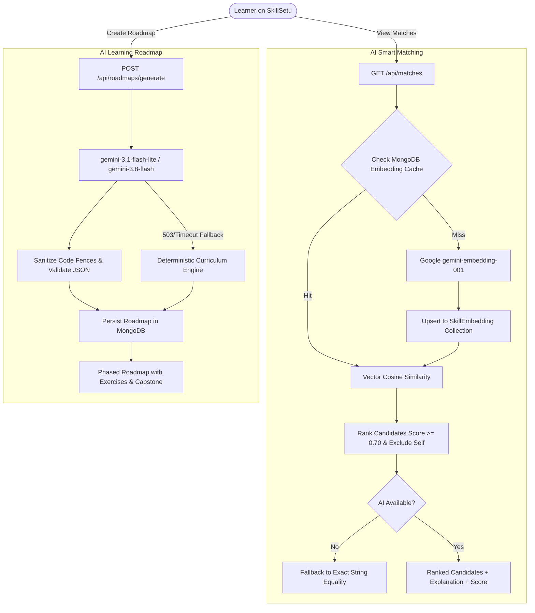

# SkillSetu

# 🌉 SkillSetu – Peer-to-Peer Skill Exchange Platform

SkillSetu is a full-stack MERN web application that enables users to exchange skills with each other without using money. Users can showcase the skills they offer, discover skills they want to learn, connect with peers, and collaborate through a modern and interactive platform.

> 💡 Learn what you want. Teach what you know.

---

## 🚀 Features

- 👤 User Authentication (JWT-based)
- 🔐 Role-Based Access Control
- 🤖 **AI Smart Skill Matching (Semantic Similarity & Candidate Ranking)**
- 🧭 **AI Personalized Learning Roadmap (Custom Curriculum & Milestone Generator)**
- 🧠 Add Skills You Offer
- 🎯 Add Skills You Want to Learn
- 🔍 Search & Match Users by Skills
- 🤝 Skill Exchange Requests
- ✅ Accept / Reject Requests
- 💬 Real-Time Chat & Messaging
- 📅 Session Scheduling System
- ⭐ Ratings & Reviews
- 📊 User Dashboard
- 🛠️ Admin Dashboard & Analytics
- 🔐 Secure Password Hashing (bcrypt)
- 🌐 RESTful API Architecture
- 📱 Fully Responsive UI
- ✨ Smooth Animations with Framer Motion

---

## 🏗️ Tech Stack

### Frontend

- React.js
- Redux Toolkit
- React Router DOM
- Axios
- Tailwind CSS
- Framer Motion
- Socket.io Client
- Vite

### Backend

- Node.js
- Express.js
- MongoDB
- Mongoose
- JWT Authentication
- bcrypt.js
- Multer
- Socket.io

---

## 📂 Project Structure

```bash
SkillSetu-FullStack/
│
├── backend/
│   ├── controllers/
│   ├── models/
│   ├── routes/
│   ├── middleware/
│   ├── config/
│   └── server.js
│
├── client/
│   ├── src/
│   │   ├── components/
│   │   ├── pages/
│   │   ├── redux/
│   │   ├── assets/
│   │   └── App.jsx
│   │
│   └── vite.config.js
│
└── README.md
```

---

## ⚙️ Installation & Setup

### 1️⃣ Clone the Repository

```bash
git clone https://github.com/shashankjai/SkillSetu-FullStack.git

cd SkillSetu-FullStack
```

---

## 📦 Backend Setup

```bash
cd backend

npm install
```

### Create `.env` file inside backend:

```env
PORT=5000

MONGO_URI=your_mongodb_connection_string

JWT_SECRET=your_secret_key

ADMIN_EMAIL=your_admin_email

ADMIN_PASSWORD=your_admin_password
```

### Run Backend Server

```bash
npm start
```

---

## 💻 Frontend Setup

```bash
cd client

npm install

npm run dev
```

Frontend will run on:

```bash
http://localhost:5173
```

---

## 🔄 How It Works

1. User registers and logs in.

2. User adds:
   - Skills they can teach
   - Skills they want to learn

3. Platform intelligently matches users based on complementary skills.

4. Users send skill exchange requests.

5. Upon acceptance, users collaborate through chat and scheduled sessions.

6. Users can review and rate each other after sessions.

---

## 📡 API Endpoints (Sample)

### Auth Routes

```http
POST /api/auth/register

POST /api/auth/login
```

### User Routes

```http
GET /api/users

GET /api/users/:id

PUT /api/users/profile
```

### Exchange Routes

```http
POST /api/exchange/request

PUT /api/exchange/:id/accept

PUT /api/exchange/:id/reject
```

### Chat Routes

```http
POST /api/messages

GET /api/messages/:chatId
```

---

### AI & Roadmap Routes

```http
GET    /api/matches              # Semantic AI skill matching with exact-match fallback
POST   /api/roadmaps/generate    # Generate & persist a personalized learning roadmap
GET    /api/roadmaps             # Retrieve authenticated user's saved roadmaps
GET    /api/roadmaps/:id         # Get specific roadmap by ID (ownership enforced)
DELETE /api/roadmaps/:id         # Delete specific roadmap by ID (ownership enforced)
```

---

## 🤖 AI Architecture & Capabilities

SkillSetu integrates **Google Gemini** natively to power two core intelligent features:



### 1. AI Smart Skill Matching
- **Model:** `gemini-embedding-001` (3,072-dimensional vector space).
- **Matching Metric:** Cosine similarity:
  $$\text{similarity}(A, B) = \frac{A \cdot B}{\|A\| \times \|B\|}$$
- **Threshold:** Calibrated to `0.70`, capturing semantic equivalencies (e.g. `React` $\leftrightarrow$ `React.js` at $0.788$, `Python` $\leftrightarrow$ `Python Programming` at $0.734$) while rejecting unrelated pairs (e.g. `React` $\leftrightarrow$ `Gardening` at $0.602$).
- **Caching Strategy:** Normalized skill text is hashed with SHA-256 (`textHash`) and persisted in MongoDB (`SkillEmbedding` collection). Repeat skill embeddings return in $<5\text{ ms}$ with zero external API calls.
- **Resilience:** If the AI service is unreachable, timed out, or unconfigured, the system automatically falls back to exact matching.

### 2. AI Personalized Learning Roadmap
- **Model:** `gemini-3.1-flash-lite` with automatic fallback to `gemini-3.8-flash`.
- **Inputs:** Target skill, current level (Beginner / Intermediate / Advanced), weekly study time, and optional goal.
- **Output:** Structured curriculum containing sequential phases, topic checklists, hands-on coding exercises, phase projects, and a final capstone milestone.
- **Security:** Private per-user persistence in MongoDB (`Roadmap` collection) with ownership enforcement (HTTP 403 Forbidden on unauthorized access).

---

## 🔐 Environment Variables

| Variable            | Description                                          | Required |
|---------------------|------------------------------------------------------|----------|
| `PORT`              | Backend server port (default: 5000)                  | Yes      |
| `MONGO_URI`         | MongoDB connection URI                               | Yes      |
| `JWT_SECRET`        | Secret key for signing authentication tokens         | Yes      |
| `GOOGLE_AI_API_KEY` | Google Gemini API key for embeddings and LLM         | Yes (for AI) |
| `ADMIN_EMAIL`       | Seeded administrator email                           | Yes      |
| `ADMIN_PASSWORD`    | Seeded administrator password                        | Yes      |

---

## 🧪 Testing

The backend includes a comprehensive Jest test suite covering vector math, stable hashing, user exclusion, ranking, fallback logic, roadmap generation, and API authorization.

```bash
# Run backend test suite
cd backend
npm test

# Run frontend production build
cd ../client
npm run build
```

---

## 📱 Responsive Design

- Mobile Friendly
- Tablet Optimized
- Desktop Responsive
- Smooth UI Animations
- Modern Gradient Backgrounds

---

## 🌟 Future Enhancements

- 📹 WebRTC Group Video Calling
- 🔔 In-App Push Notifications
- 🌍 Public Portfolio Profiles
- ☁️ Cloud Storage Integration (AWS S3)
- 🚀 One-Click Cloud Deployment (Render / Vercel / Railway)

---

## 👨‍💻 Author

**Shashank Jaiswal**  
B.Tech IT | NIT Raipur  
Aspiring Full Stack Developer

---

## 📄 License

This project is licensed under the MIT License.

---

## 🌐 GitHub Repository

https://github.com/shashankjai/SkillSetu-FullStack